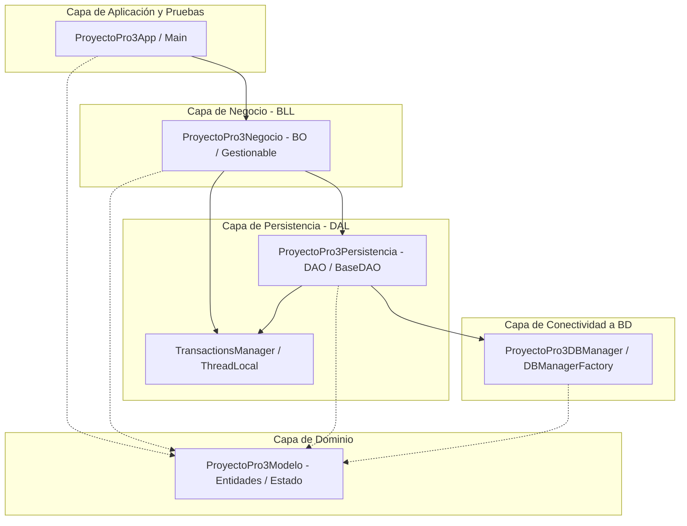
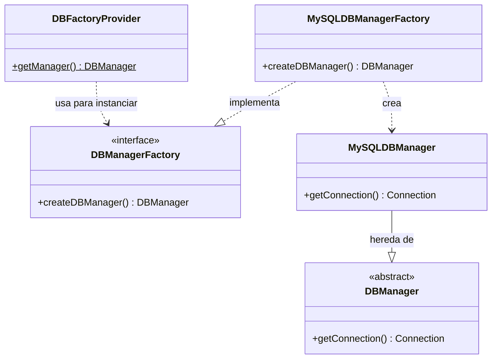
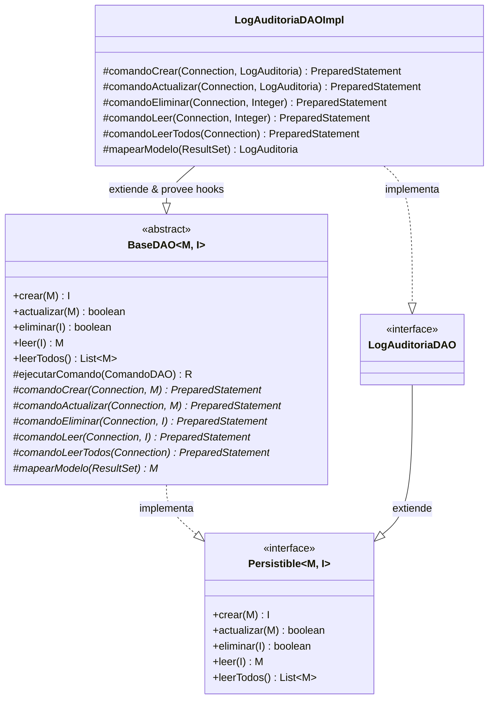
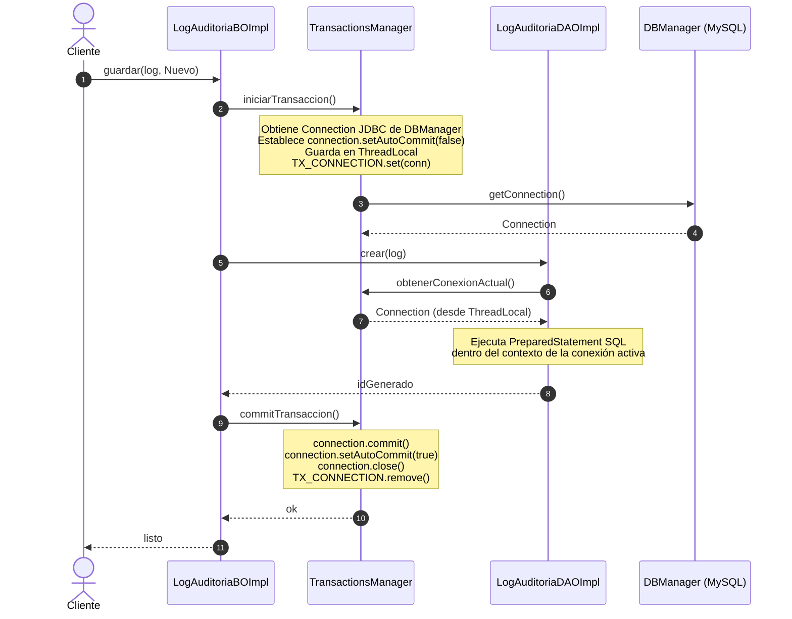

# ProyectoPro3 — Arquitectura Multicapa y Patrones de Diseño

Este proyecto es una aplicación Java modular diseñada bajo los lineamientos de una **Arquitectura Multicapa (N-Layer Architecture)**. El objetivo principal es estructurar la lógica de negocio y persistencia de múltiples módulos funcionales (Auditoría, Autenticación, CRM, Reservas, Reclamos, Notificaciones, Reportes y Webhooks) garantizando la separación de responsabilidades, extensibilidad del código y consistencia transaccional.

---

## 📂 Arquitectura Detallada (Capa por Capa)

A continuación se presenta el diagrama de comunicación y jerarquía entre las diferentes capas del proyecto:



---

### 1. 🏗️ [ProyectoPro3Modelo](file:///c:/pucp/26.1/pro3/PROYECTO_TA/ProyectoProgramacion3/ParteJava/ProyectoPro3/ProyectoPro3Modelo) (Capa de Dominio/Entidades)
*   **Propósito:** Definir el modelo de datos unificado y las entidades del dominio de negocio. Es la fuente única de verdad sobre las estructuras de información que maneja el sistema (ej. qué atributos tiene un `Usuario` o un `LogAuditoria`). Sirve como contrato de intercambio de información entre todas las capas físicas del sistema.
*   **Responsabilidad:** Representar los conceptos de negocio en forma de objetos y enumerados libres de dependencias tecnológicas o de infraestructura.
*   **Aspectos Clave:**
    *   **Modelo de Dominio Anémico:** Los objetos no contienen lógica de infraestructura ni realizan llamadas directas a base de datos.
    *   **Enumerado de Estado:** Define [`Estado`](file:///c:/pucp/26.1/pro3/PROYECTO_TA/ProyectoProgramacion3/ParteJava/ProyectoPro3/ProyectoPro3Modelo/src/main/java/pe/edu/pucp/proyectopro3/modelo/Estado.java) (`Nuevo`, `Modificado`, `Eliminado`), empleado en las capas superiores para discernir qué acción persistir en la base de datos.

### 2. 🔌 [ProyectoPro3DBManager](file:///c:/pucp/26.1/pro3/PROYECTO_TA/ProyectoProgramacion3/ParteJava/ProyectoPro3/ProyectoPro3DBManager) (Capa de Conectividad y Proveedor de Conexiones)
*   **Propósito:** Desacoplar la procedencia física y la inicialización de la conexión JDBC de la lógica de acceso a datos de los DAOs. Esto permite cambiar el motor de bases de datos o el pool de conexiones en un único punto sin afectar al resto de la aplicación.
*   **Responsabilidad:** Cargar controladores JDBC, resolver las credenciales y URLs de conexión de base de datos, y entregar una conexión activa (`Connection`) al proveedor global.
*   **Diseño:** Implementa fábricas y un proveedor para evitar acoplar la aplicación a un motor de base de datos específico (ej. MySQL).

### 3. 💾 [ProyectoPro3Persistencia](file:///c:/pucp/26.1/pro3/PROYECTO_TA/ProyectoProgramacion3/ParteJava/ProyectoPro3/ProyectoPro3Persistencia) (Capa de Acceso a Datos - DAO)
*   **Propósito:** Ocultar la complejidad técnica de las sentencias SQL relacionales y de la API de JDBC. Se encarga de transformar las entidades Java de la capa de Modelo en filas de bases de datos relacionales y viceversa.
*   **Responsabilidad:** Preparar consultas SQL (`PreparedStatement`), ejecutar procedimientos almacenados, mapear el resultado de la base de datos (`ResultSet`) de regreso a objetos de dominio y gestionar de forma segura la liberación de recursos de base de datos.
*   **Diseño:** Provee el contrato de persistencia genérica mediante interfaces y una clase base que automatiza el manejo repetitivo de JDBC.

### 4. 🧠 [ProyectoPro3Negocio](file:///c:/pucp/26.1/pro3/PROYECTO_TA/ProyectoProgramacion3/ParteJava/ProyectoPro3/ProyectoPro3Negocio) (Capa de Lógica de Negocio - BO)
*   **Propósito:** Ser el cerebro operacional del sistema. Controla que todos los datos de entrada cumplan con los criterios de integridad y políticas operativas de la organización antes de permitir su almacenamiento definitivo. También es el responsable de definir los límites transaccionales de los casos de uso.
*   **Responsabilidad:** Validar restricciones del negocio (ej. campos obligatorios, IDs positivos, condiciones lógicas de los servicios), y asegurar la atomicidad coordinando transacciones que involucren a uno o varios DAOs (mediante el Transaction Manager).
*   **Diseño:** Utiliza fachadas de negocio que controlan el flujo transaccional y delegan al DAO únicamente cuando el estado de los datos es consistente.

### 5. 🖥️ [ProyectoPro3App](file:///c:/pucp/26.1/pro3/PROYECTO_TA/ProyectoProgramacion3/ParteJava/ProyectoPro3/ProyectoPro3App) (Capa de Aplicación y Pruebas)
*   **Propósito:** Servir como interfaz de usuario o consumidor externo de la aplicación. Es la capa responsable de iniciar la aplicación, recibir peticiones externas y canalizarlas hacia los flujos de negocio.
*   **Responsabilidad:** Configurar los puntos de arranque del sistema y hospedar los arneses de prueba de integración de extremo a extremo que disparan las validaciones sobre los Business Objects.


---

## 🛠️ Patrones de Diseño Implementados

### A. Abstract Factory & Factory Method (Conectividad)
Para evitar instanciar directamente gestores de conexión SQL en los DAOs, se utiliza una jerarquía de fábricas de conexión.


*   **DBFactoryProvider**: Registra y expone de manera estática el gestor actual (`DBManager`).
*   **DBManagerFactory**: Interfaz que define el método de fabricación de administradores de bases de datos.
*   **MySQLDBManagerFactory**: Fábrica concreta que instancia objetos de tipo `MySQLDBManager`.

---

### B. Generic DAO & Template Method (Acceso a Datos)
El patrón **Generic DAO** proporciona una interfaz común para operaciones CRUD, mientras que el patrón **Template Method** en [`BaseDAO`](file:///c:/pucp/26.1/pro3/PROYECTO_TA/ProyectoProgramacion3/ParteJava/ProyectoPro3/ProyectoPro3Persistencia/src/main/java/pe/edu/pucp/proyectopro3/dao/BaseDAO.java) estandariza el flujo JDBC de ejecución, delegando únicamente la configuración de consultas a clases concretas.


*   **Template Method:** El método `leer(id)` en `BaseDAO` abre la conexión JDBC, crea el PreparedStatement llamando al método hook `comandoLeer(conn, id)`, ejecuta la sentencia SQL, procesa el `ResultSet` a través del hook `mapearModelo(rs)`, y finalmente cierra todos los recursos JDBC de forma segura. Las implementaciones hijas como `LogAuditoriaDAOImpl` solo necesitan implementar los métodos hook marcados con `*` en el diagrama.

---

### C. Command Pattern & ThreadLocal Unit of Work (Consistencia Transaccional)
Para permitir que múltiples operaciones DAO se ejecuten dentro de una misma transacción SQL sin pasar explícitamente el objeto `Connection` entre métodos, se emplea la combinación del patrón **Command** y variables de hilo local (**ThreadLocal**).


1.  **Command Pattern:** La interfaz funcional [`ComandoDAO<R>`](file:///c:/pucp/26.1/pro3/PROYECTO_TA/ProyectoProgramacion3/ParteJava/ProyectoPro3/ProyectoPro3Persistencia/src/main/java/pe/edu/pucp/proyectopro3/dao/ComandoDAO.java) encapsula la lógica ejecutable que interactúa con la base de datos a través de una expresión lambda, aislando los bloques `try-catch` de la conexión JDBC.
2.  **ThreadLocal Unit of Work:** [`TransactionsManager`](file:///c:/pucp/26.1/pro3/PROYECTO_TA/ProyectoProgramacion3/ParteJava/ProyectoPro3/ProyectoPro3Persistencia/src/main/java/pe/edu/pucp/proyectopro3/dao/TransactionsManager.java) almacena la conexión de la transacción activa en un `ThreadLocal<Connection>`. Los DAOs consultan `obtenerConexionActual()`:
    *   Si existe una conexión transaccional en el hilo actual, la reutilizan, permitiendo realizar múltiples inserciones o actualizaciones atómicas.
    *   Si no existe una transacción activa en el hilo, el DAO obtiene y cierra una conexión limpia de manera individual (auto-commit por defecto).

---

### D. State-Driven CRUD Pattern (Negocio / Gestión de Cambios)
Para encapsular el tipo de guardado (Inserción o Edición), el cliente o llamador no interactúa directamente con los métodos `crear()` o `actualizar()` del DAO. En su lugar, utiliza el método `guardar` de la interfaz [`Gestionable<T>`](file:///c:/pucp/26.1/pro3/PROYECTO_TA/ProyectoProgramacion3/ParteJava/ProyectoPro3/ProyectoPro3Negocio/src/main/java/pe/edu/pucp/proyectopro3/bo/Gestionable.java):

```java
public interface Gestionable<T> {
    void guardar(T modelo, Estado estado);
}
```

Al invocar `guardar(modelo, Estado.Nuevo)`, la capa BO valida los campos de la entidad y delega en el método `crear()` del DAO. Por otro lado, al invocarlo con `Estado.Modificado`, el BO delega en el método `actualizar()` del DAO correspondientemente, abstrayendo la decisión de flujo de la capa de presentación.

---

### E. Integración de Webhooks y API RESTful (JAX-RS)
Para habilitar el consumo externo y servir como backend completo (preparado para integrarse con un Frontend en C#), se implementó la capacidad de procesar **Webhooks de Bókun** exponiendo APIs RESTful.

*   **Persistencia y Stored Procedures:**
    *   **`WebhookBokunDAO`** / **`WebhookBokunDAOImpl`**: Capa especializada en procesar el payload del Webhook. A diferencia de un CRUD convencional, delega la carga pesada al procedimiento almacenado de BD `sp_ProcesarYDispersarWebhookBokun`, garantizando rapidez y transaccionalidad al insertar en tablas complejas (Reserva, Detalle, WebhookLog, etc.).
*   **Lógica de Negocio:**
    *   **`WebhookBokunBO`** / **`WebhookBokunBOImpl`**: Abstrae al controlador web de la complejidad del DAO y valida la coherencia inicial del payload recibido.
*   **Presentación y Exposición REST (`ProyectoPro3RS_BOKUN`):**
    *   Se dispone de una carpeta independiente para hospedar los Web Services. **No** es un submódulo gestionado por Maven ni Ant en este repositorio, sino un proyecto nativo de servicios REST (para que sea importado o creado bajo ese formato en el IDE).
    *   Se utiliza el estándar nativo **Jakarta EE (JAX-RS)** preparado para ser desplegado en servidores de aplicaciones (como **GlassFish** o **Payara**).
    *   **`ApiConfig`**: Clase que hereda de `jakarta.ws.rs.core.Application` anotada con `@ApplicationPath("/api")` para definir la raíz de todos los endpoints.
    *   **`BokunResource`**: Clase anotada con JAX-RS (`@Path`, `@POST`) que expone la ruta `/v1/bokun/webhook`, maneja los códigos HTTP (`Response`) y delega el payload JSON de Bókun hacia la capa de negocio.

---

## 🚀 Cómo Ejecutar el Proyecto

1.  Asegúrate de configurar los parámetros de conexión JDBC de tu base de datos local en [`MySQLDBManager`](file:///c:/pucp/26.1/pro3/PROYECTO_TA/ProyectoProgramacion3/ParteJava/ProyectoPro3/ProyectoPro3DBManager/src/main/java/pe/edu/pucp/proyectopro3/db/MySQLDBManager.java).
2.  Compila el proyecto principal usando Maven:
    ```bash
    mvn clean install
    ```
3.  Ejecuta la clase principal [`Main`](file:///c:/pucp/26.1/pro3/PROYECTO_TA/ProyectoProgramacion3/ParteJava/ProyectoPro3/ProyectoPro3App/src/main/java/pe/edu/pucp/proyectopro3/app/Main.java) desde tu IDE o la consola para verificar que todas las pruebas automatizadas de negocio se ejecuten exitosamente.
